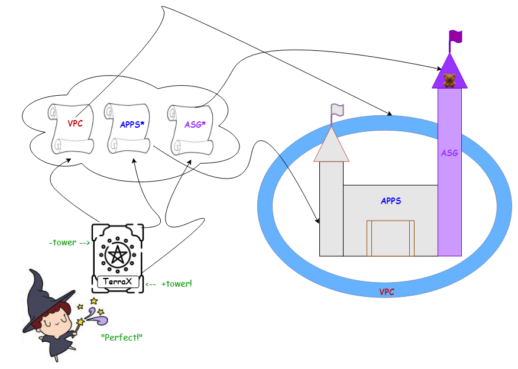

# Terra's Castle

### A Terraform Refactoring story for kids of all ages

**O**nce upon a time, there was a young sorceress named `Terra` who wanted to create a castle.  Her father gave her a spellbook that contained 2 spells.  The first spell (`vpc`) created a giant moat to protect the castle from danger.  The second spell (`apps`) created a beautiful castle.  Terra's favorite part of the castle was the `us-east-1` (East) Tower.  She would run up and down the stairs all day long and hide her toys at the top.

One day, Terra had an idea.  She wanted to make the East Tower taller (`ebs_size`).  She opened up her spellbook, changed some of the words around and spoke the magic words.  The tower grew exactly as she had hoped!

Next, she wanted to make the East Tower purple.  But spells were like wishes and if you didn't get the words just right, you could have unwanted results.  She didn't want to accidentally make the drawbridge purple.  At least, not yet!

Terra  asked her father for advice and he gave her a new spell that only affected the Tower.  But when Terra cast the Tower spell, it fizzled!  Sparks and smoke flew out of her wand in failure.  Her father told her that this happened because both the Castle Spell and the Tower Spell were trying to create the same tower.  "You can't create something that already exists," he said.

"Okay," thought Terra.  "I'll just remove the tower from the Castle Spell then."  But when she did that, something unexpected happened.  The tower disappeared for a few seconds and then reappeared, empty.  "Oh no!" cried Terra.  "All of my toys are gone!  What happened?"  She ran to her father to ask what went wrong.  

Her father thought for a moment and said, "Well, I need to teach you a little more about how our magic works.  When you cast a spell to create something, a magic scroll is created in the `cloud`s.  This scroll contains a picture of what you created.  When you removed the tower from the Castle _spell_, it no longer matched the picture on the Castle _scroll_, so the magic thought that you wanted to `destroy` the tower.  What you'll want to do is to erase the tower from both the spellbook AND the scroll."

Terra did exactly her father told her to do.  She summoned the scrolls from the clouds and erased the East Tower from the picture of the castle, while also drawing a copy of it on the Tower Scroll.  Then she used her magic hourglass to go back in time and try again.

This time, when Terra cast her spells, the main castle sparkled and the East Tower turned purple.  Her toys were still inside the tower, exactly as she left them.  It was perfect!  "Hooray!" she said.  "It worked!"  She had the biggest smile on her face because she now knew that she could make as many changes as she wanted to the tower and wouldn't have to worry about disturbing the rest of the castle.

## The End

### Moral of the story
Always listen to your dad.
